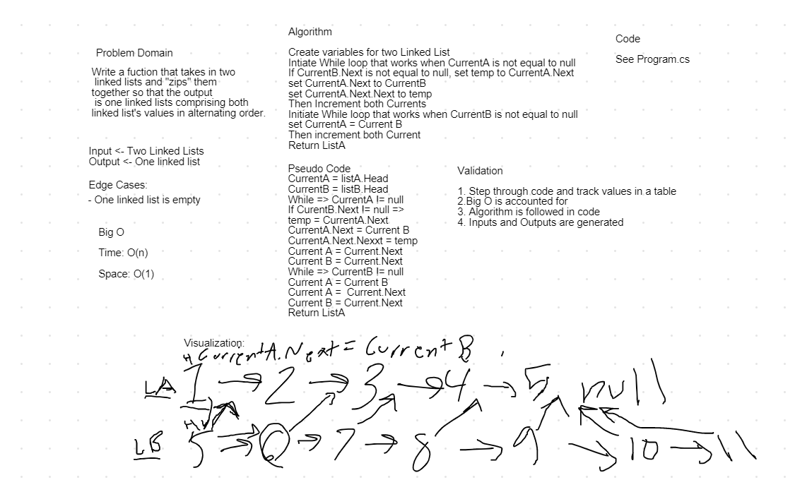

# Zip Linked Lists
*Author: Nicco Ryan*

---

### Problem Domain
#### Given two linked lists, zip them into one with the values alternating.
---

### Inputs and Expected Outputs

| Input | Expected Output |
| :----------- | :----------- |
| [1, 2, 3, 4], [5, 6, 7, 8] | [1, 5, 2, 6, 3, 7, 4, 8] |

---

### Big O

| Time | Space |
| :----------- | :----------- |
| O(n) | O(n) |

---

### Whiteboard Visual

*Made w/ Robert Carter*

---

### Change Log
1.1: *Problem completed* - 7/16/2020 

---
