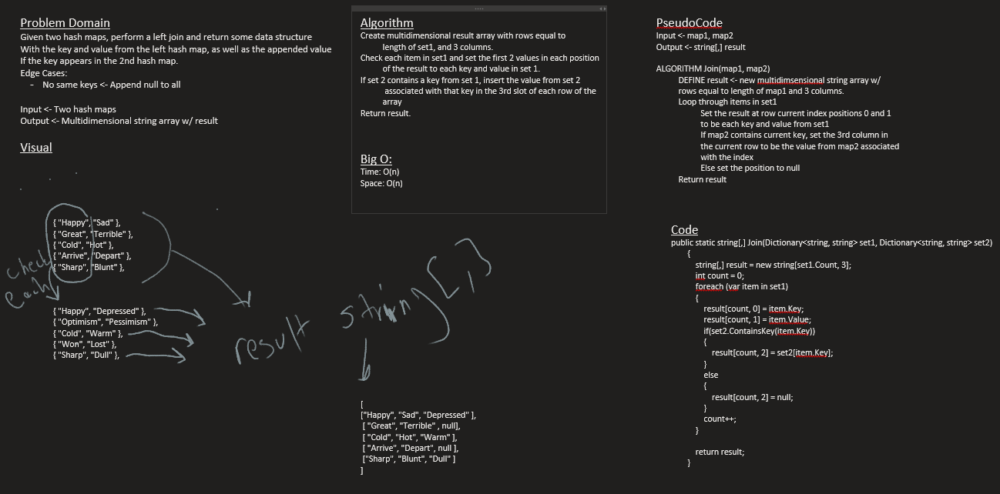

# Left Join
*Author: Nicco Ryan*

---

### Problem Domain
Given two Hash Maps of string key and string values, return a data structure representing a Left Join on the tables, if a key exists in both tables that location in the resulting structure should have both of the values following it, if not it should have the first map's value followed by null.

---

### Inputs and Expected Outputs

| Input | Expected Output |
| :----------- | :----------- |
| Any two hash maps with strings | A multidimensional string array with with rows equal to the length of string 1 returning Left Join result |

---

### Big O

| Method | Time | Space |
| :----------- | :----------- | :----------- |
| Join | O(n) | O(n) |

---

### Whiteboard Visual

---

### Change Log
1.0: *Problem completed* - 8/20/2020

---
