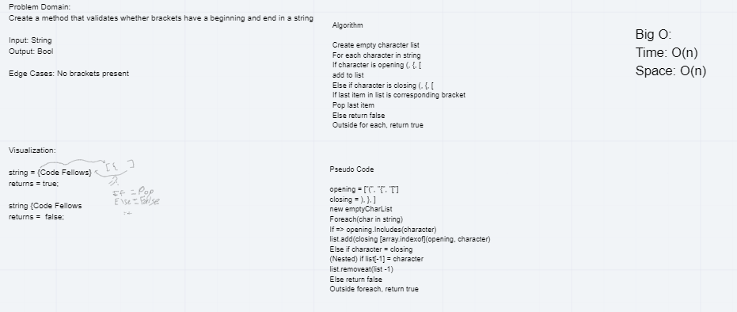

# Multi-Bracket Validation
*Author: Nicco Ryan*

---

### Problem Domain
Given any string, return if the brackets within the string are arranged correctly, i.e. :"{[Words(more words)Some more stuff]stuff}" returns true.

---

### Inputs and Expected Outputs

| Input | Expected Output |
| :----------- | :----------- |
| "{[Words(more words)Some more stuff]stuff}" | true |
| "({)}" | false |

---

### Big O

| Time | Space |
| :----------- | :----------- |
| O(n) | O(1) |

---

### Whiteboard Visual

*Made with Bade Habib & Robert Carter*

---

### Change Log
1.0: *Problem completed* - 7/22/2020

---
