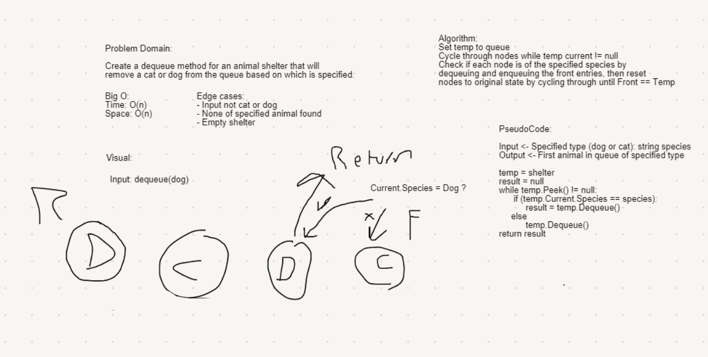

# FIFO Animal Shelter
*Author: Nicco Ryan*

---

### Problem Domain
An animal shelter simulation than can take in dogs and cats and return specified types on dequeuing.

---

### Big O

| Method | Time | Space |
| :----------- | :----------- | :----------- |
| Enqueue | O(1) | O(1) |
| Dequeue | O(n) | O(1) |

---

### Whiteboard Visual

---

### Change Log
1.2: *Fixed Dequeue* - 7/24/2020
1.1: *Updated Solution - 7/22/2020*
1.0: *Problem completed* - 7/21/2020 

---
