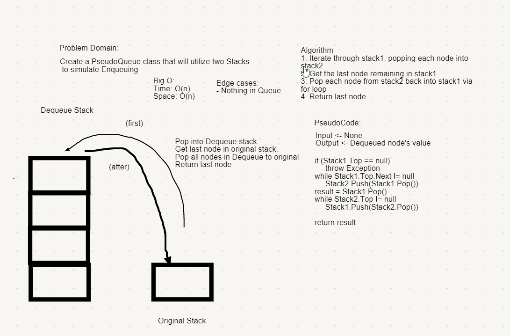

# Queue With Stacks
*Author: Nicco Ryan*

---

### Problem Domain
Simulate the behavior of a Queue using two stacks under the hood w/ Enqueue and Dequeue methods.

---

### Big O

| Method | Time | Space |
| :----------- | :----------- | :----------- |
| Enqueue | O(n) | O(1) |
| Dequeue | O(1) | O(1) |

---

### Whiteboard Visual

---

### Change Log

1.0: *Problem completed* - 7/22/2020 

---
