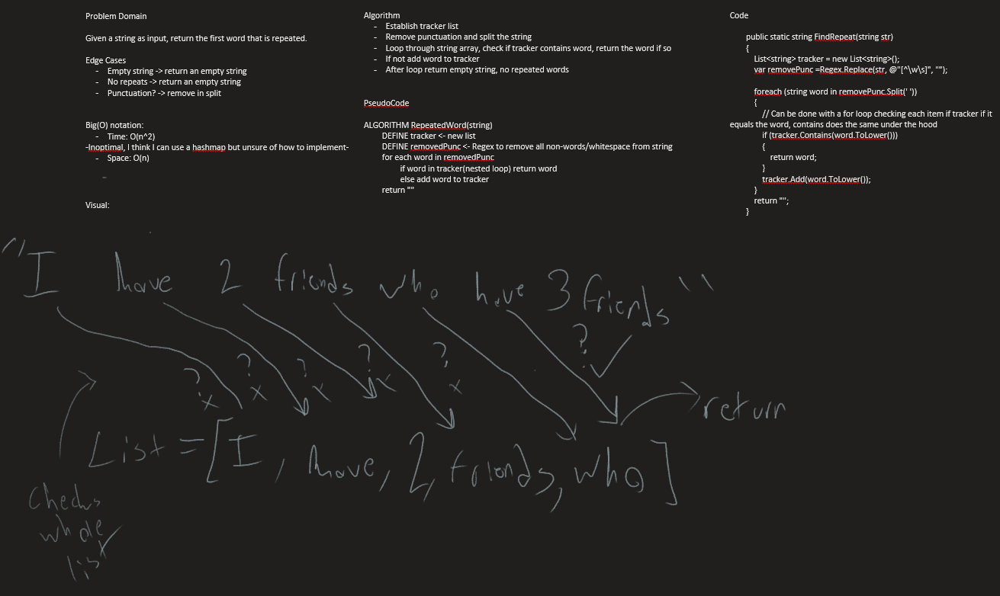

# Repeated Words
*Author: Nicco Ryan*

---

### Problem Domain
Given any string, create methods to find the first repeated word, as well as to count all the words and order them by their rate of occurence.

---

### Inputs and Expected Outputs

| Input | Expected Output |
| :----------- | :----------- |
| "It was a queer, sultry summer, the summer they electrocuted the Rosenbergs, and I didn’t know what I was doing in New York..." | "summer" |
| "Once upon a time, there was a brave princess who..." | "a" |
| "This sentence must contain no repeating words within it." | "" |

---

### Big O

| Method | Time | Space |
| :----------- | :----------- | :----------- |
| FindRepeat | O(n^2) | O(n) |
| CountAndOrderWords | O(n^2) | O(n) |

---

### Whiteboard Visual

---

### Change Log
1.0: *Problem completed* - 8/17/2020

---
