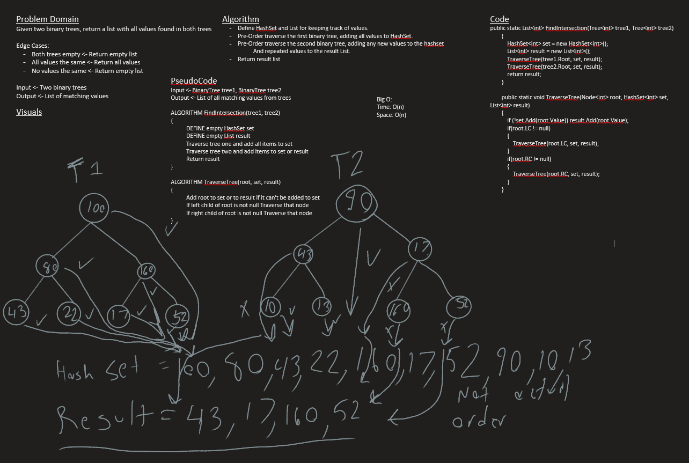

# Tree Intersection
*Author: Nicco Ryan*

---

### Problem Domain
Given two binary trees of integers, return a list with all values that appear in both trees.

---

### Inputs and Expected Outputs

| Input | Expected Output |
| :----------- | :----------- |
| Tree1: 55, 108, 100, 167, 83, 3, 44   Tree2:  5, 109, 10, 12, 44, 167, 83 | [44, 167, 83 |

---

### Big O

| Method | Time | Space |
| :----------- | :----------- | :----------- |
| FindIntersection | O(n) | O(n) |

---

### Whiteboard Visual

---

### Change Log
1.0: *Problem completed* - 8/18/2020

---
