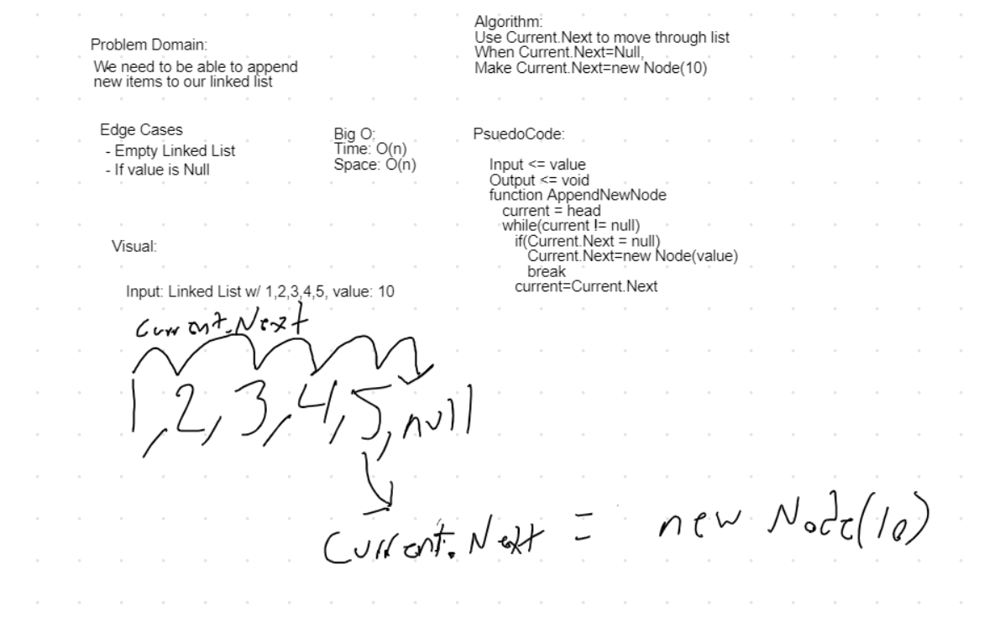

# Linked List

*Author: Nicco Ryan*

---

## Description
A C# implementation of a Singly Linked List and associated methods including methods to add and find nodes within the list. The list is composed of "Nodes" which have data stored for both what the next node in the list is as well as the value the node holds. The methods of this `Linked List` are `Insert`, `Includes`, `Print`, `Append`, `InsertBefore`, `InsertAfter` and `kthFromEnd`.

---

## Methods

| Method | Summary | Big O Time | Big O Space | Example | 
| :----------- | :----------- | :-------------: | :-------------: | :----------- |
| Insert | Adds a new `Node` to the `Linked List` | O(1) | O(1) | list.Insert(99) |
| Includes | Takes in a value and returns a boolean depending on if the value is in the `LinkedList` | O(n) | O(1) | list.Includes(99) |
| Print | Prints the `Linked List` to the console | O(n) | O(1) | list.Print() |
| Append | Appends a new node of specified value to the `Linked List` | O(n) | O(1) | list.Append(34) |
| InsertBefore | Adds a new node before specified node (first parameter) of specified value (second parameter) to the `Linked List` | O(n) | O(1) | list.InsertBefore(15, 24) |
| InsertAfter | Adds a new node after specified node (first parameter) of specified value (second parameter) to the `Linked List` | O(n) | O(1) | list.InsertAfter(15, 24) |
| kthFromEnd | Returns the kth node from the end of the Linked List's value. | O(n) | O(1) | list.kthFromEnd(2) |

---
## Visuals
#### Append Node

#### Find Kth From End

## Change Log
1.2: *Added kthFromEnd methods.* - 14 July 2020  
1.1: *Added Append, InsertBefore and InsertAfter methods.* - 13 July 2020  
1.0: *Created Insert, Includes and Print methods.* - 10 July 2020