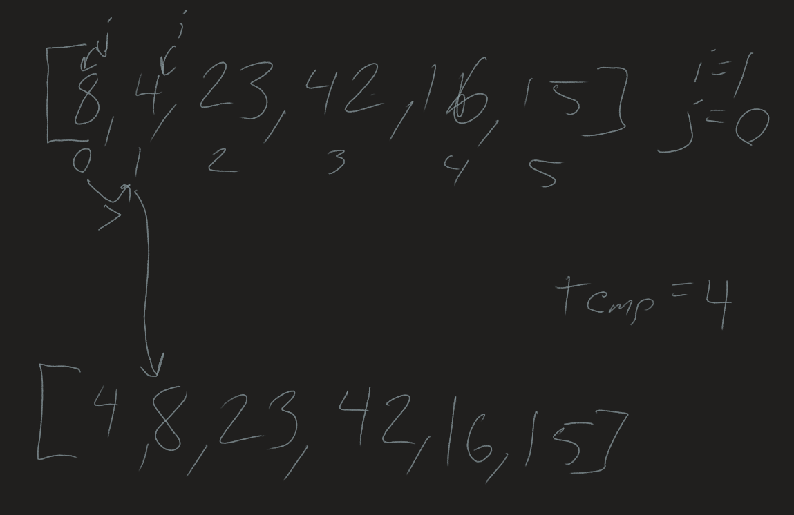
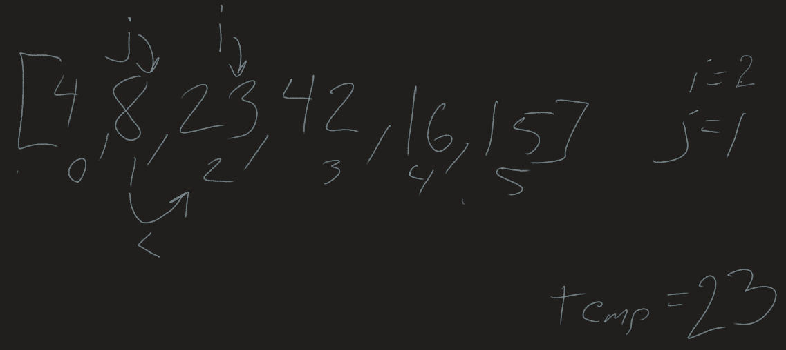
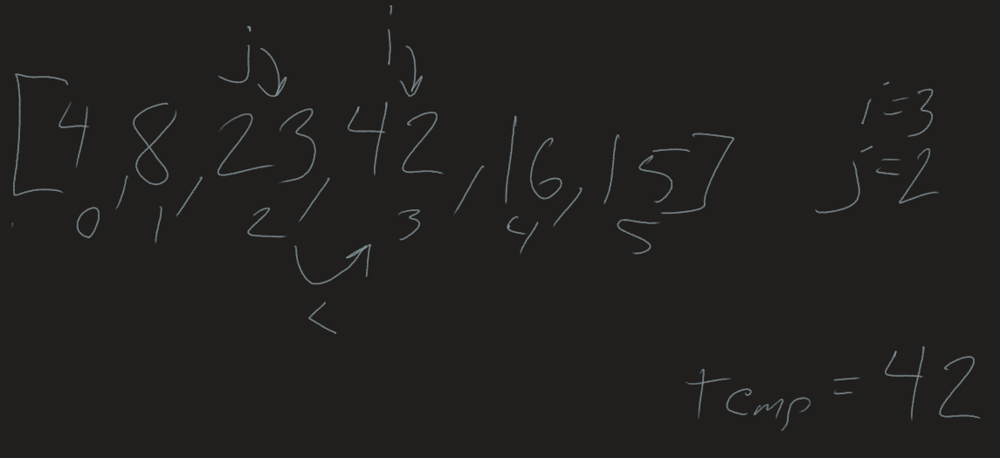
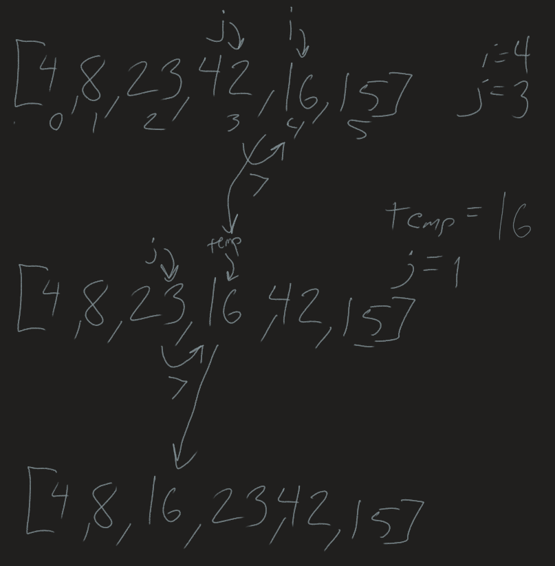
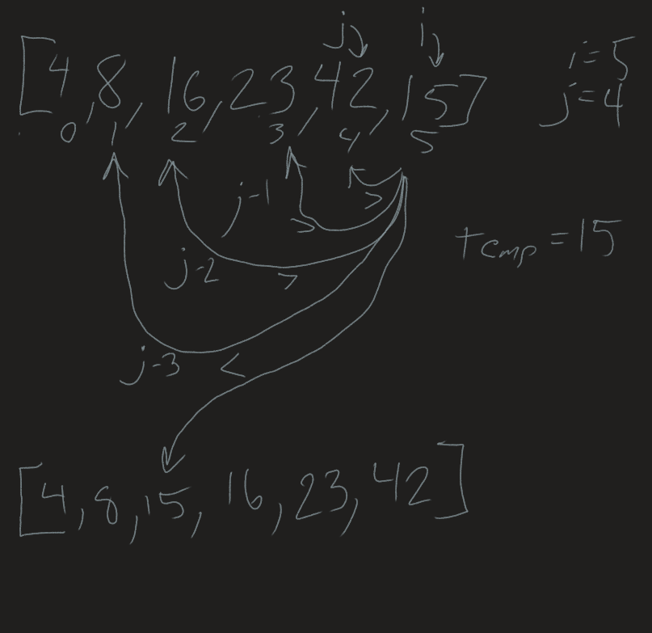

# Insertion Sort
*Author: Nicco Ryan*

An insertion sort is a method of sorting which iterates through an array, comparing each item to the one behind it and moving it backwards until it locates a value that is less than it. It keeps track of the current value using a temp and sets the integer j back progressively to find the correct location for the integer.

## Pseudocode
```
InsertionSort(int[] arr)

  FOR i = 1 to arr.length
  
    int j <-- i - 1
    int temp <-- arr[i]
    
    WHILE j >= 0 AND temp < arr[j]
      arr[j + 1] <-- arr[j]
      j <-- j - 1
      
    arr[j + 1] <-- temp
```
---
## Trace

```
[8,4,23,42,16,15]
```
---
**Pass 1**

In the first pass, i is set to 1 which is a 4 in the example, and j is set to 0, 8. Because the temp, or the array at i, is less than the array at j, the values are switched and j is set to -1, ending the while loop.

**Pass 2**

On this pass, 23 is found to be greater than 8 and no changes are made to the array.

**Pass 3**

On this pass, 42 is found to be greater than 23 and no changes are made to the array.


**Pass 4**

On this pass, 16 is first compared to 42, and found to be less, so the array at j is moved forward by 1, and j is set to index 2, or 23, which is also greater than 16, so the same process takes place. Finally 16 will be compared to array at 1, which is 8 and less than 16 so the while loop ends and temp is set to the place above j.

**Pass 5**

On this pass, similar to the fourth pass, the temp is set to 15, which is compared to all of the previous values and moved back until it also reaches the position where j = 1, or the value 8, where it will evaluate to less than the temp, and the temp will be set to array at index j+1, or 2.

After the fifth pass the outer for loop is completed and the array is fully sorted.

## Efficiency
- Time: O(n^2)
  - This algorithm relies on a nested loop to make it's comparison. In the worst case, each index in the array will need to be checked against every other index, making it n squared for time.
- Space: O(1)
  - The array is sorted in place and no additional space is taken up, so it will be O(1) for space.