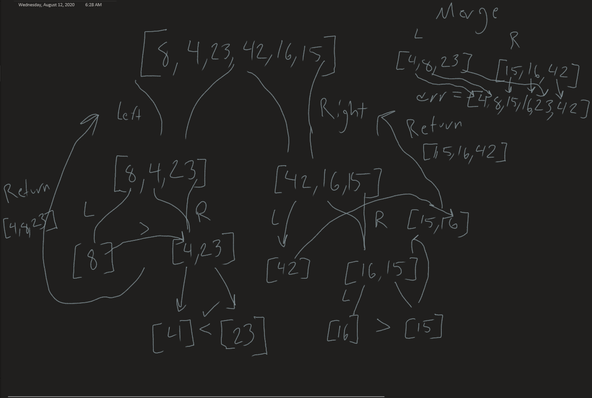

# Merge sort
*Author: Nicco Ryan*

If you've ever heard the old adage to "Divide and conquer" you're familiar with the basics of what a merge sort is doing. A merge sort is a sorting algorithm which takes in an array and repeatedly halves the array into two smaller arrays, calling itself recursively, until each smaller array consists of only one number and the two numbers are compared and can be merged. This occurs for each section of the array, repeatedly merging these sublists until one one remains, that one being the sorted list.

## Pseudocode
```
ALGORITHM Mergesort(arr)
    DECLARE n <-- arr.length
           
    if n > 1
      DECLARE mid <-- n/2
      DECLARE left <-- arr[0...mid]
      DECLARE right <-- arr[mid...n]
      // sort the left side
      Mergesort(left)
      // sort the right side
      Mergesort(right)
      // merge the sorted left and right sides together
      Merge(left, right, arr)

ALGORITHM Merge(left, right, arr)
    DECLARE i <-- 0
    DECLARE j <-- 0
    DECLARE k <-- 0

    while i < left.length && j < right.length
        if left[i] <= right[j]
            arr[k] <-- left[i]
            i <-- i + 1
        else
            arr[k] <-- right[j]
            j <-- j + 1
            
        k <-- k + 1

    if i = left.length
       set remaining entries in arr to remaining values in right
    else
       set remaining entries in arr to remaining values in left
```
---
## Trace

```
[8,4,23,42,16,15]
```
---
## Visual



### Start

*Input:* [8,4,23,42,16,15]

The MergeSort algorithm begins by setting n to length of the array, 6 for our trace, and if n is greater than 1, an array of length 1 would already be sorted, it declares a mid point at n/2, or 3 in our case, and splits the input array in half, filling the "left" with everything up to the mid point, and the "right" with everything including and after it. It then calls itself Recursively on the left side first.

*Left:* [8,4,23]

*Right:* [42,16,15] 

**Mergesort(initial-left)**

*Input:* [8,4,23]

*n = 3, mid = 1*

With the left half of the initial array, our value for n is set to the length, 3, and the midpoint would be 1. This means that the "left" array during this pass will be populated with just the 8, and the right will have 4 and 23.

*Left:* [8]

*Right:* [4,23] 

**Mergesort(initial-left-left)**

*Input:* [8]

*n = 1*

Because n is no longer greater than one, the method is skipped for this, sending 8 up a level and immediately popping off of the call stack.

*return:* [8]


**Mergesort(initial-left-right)**

*Input:* [4,23]

*n = 2, mid = 1*

The array passed in to the this call will be split perfectly in half, meaning that it's going to have the single numbers 4 and 23 returned as it's left and right values, which it will then pass into the Merge algorithm shown in the pseudocode, along with the the array itself. 

*Left:* [4]

*Right:* [23]

**Merge([4], [23], [4,23])**

After values are set and the while loop is entered, left[0] is less than right[0] so the arr[0] is reduntantly set to left[0], or 4. The while loop then terminates and the array is populated with the remaining values in right, being 23, for the remaining k index of 1.

**Mergesort(initial-right)**

*Input:* [42,16,15]

*n = 3, mid = 1*

With the right half of the initial array, the process is very similar to what happened on the left half. The new array is split with one element, 42, in the left nad two elements, 16 and 15, in the right. It will return 42 from the Mergesort(left) call, and the Merge algorithm will sort the right and return 15 and 16. Following this, the left and right are passed into merge, where the while loop will start and left[i] will be greater than right[j] twice in a row, making arr[0,1] 15 and 16 respectively, then terminating the while loop and populating the remaining values from left, or just the 42.

*Left:* [42]

*Right(After sorting):* [15,16] 

*Return:* [15,16,42]

**Final Merge**

*Input left:* [4,8,23]
*Input right:* [15,16,42]
*Input arr:* [8,4,23,42,16,15]

The if statements within the while loop will cause the following values of arr to be assigned:
- k : left[i] ><= right[j] = arr[k]
- 0 : 4 > 15 = 4
- 1 : 8 > 15 = 8
- 2 : 23 < 15 = 15
- 3 : 24 < 16 = 16
- 4 : 24 > 42 = 24
- 5 : 42 (populated from remaining values in right)


## Efficiency
- Time: O(n * log(n))
  - This algorithm relies on a series of recursive calls to continuously halve itself, due to the halving process creating a log(n) time and then to merge the sub arrays by dividing and comparing the original n elements in worst case, giving the additional n.
- Space: O(n)
  - A copy of the array must be made when it is split in half, making the space O(n)