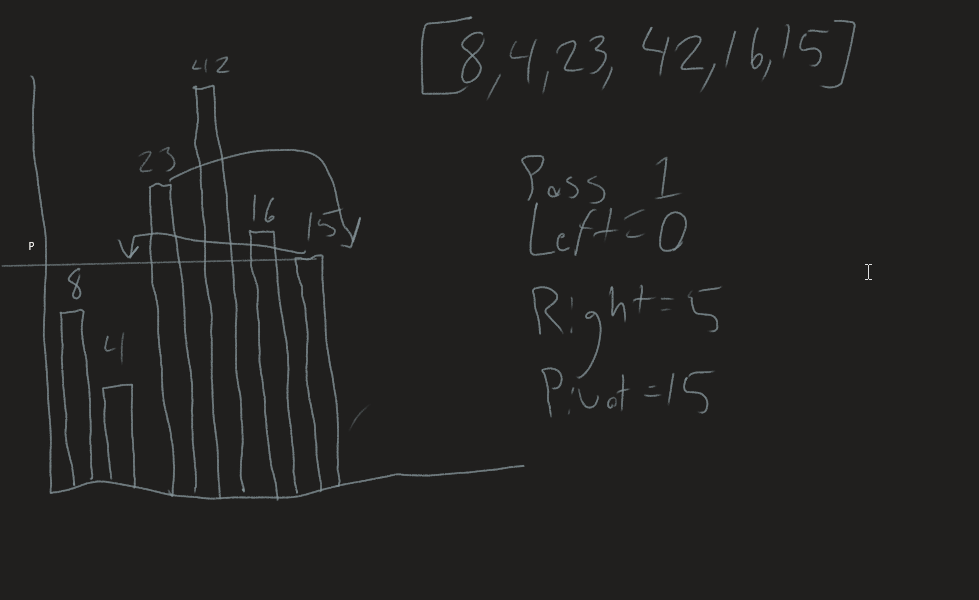
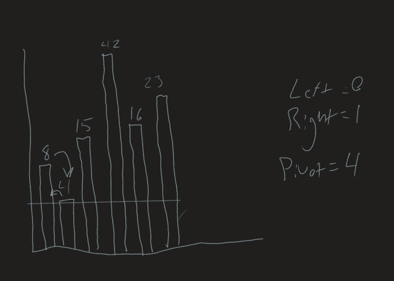

# Quick sort
*Author: Nicco Ryan*

Quick sorts are another sort of Divide and Conquer sorting algorithm, wherein an element is picked as a "pivot" and the array is partitioned around the pivot. The partition works by placing an element x at it's correct position in the current array and put all smaller elements behind it and all greater elements after it. This will continuously sort the entire array more and more as more elements are sorted around the pivots.

## Pseudocode
```
ALGORITHM QuickSort(arr, left, right)
    if left < right
        // Partition the array by setting the position of the pivot value 
        DEFINE position <-- Partition(arr, left, right)
        // Sort the left
        QuickSort(arr, left, position - 1)
        // Sort the right
        QuickSort(arr, position + 1, right)

ALGORITHM Partition(arr, left, right)
    // set a pivot value as a point of reference
    DEFINE pivot <-- arr[right]
    // create a variable to track the largest index of numbers lower than the defined pivot
    DEFINE low <-- left - 1
    for i <- left to right do
        if arr[i] <= pivot
            low++
            Swap(arr, i, low)

     // place the value of the pivot location in the middle.
     // all numbers smaller than the pivot are on the left, larger on the right. 
     Swap(arr, right, low + 1)
    // return the pivot index point
     return low + 1

ALGORITHM Swap(arr, i, low)
    DEFINE temp;
    temp <-- arr[i]
    arr[i] <-- arr[low]
    arr[low] <-- temp
```
---
## Trace

```
[8,4,23,42,16,15]
```
---
## Visual


### Step Through
*Input:* [8,4,23,42,16,15]

**First step**



*Left:* 0

*Right:* 5

*Pivot:* 15

*Partition:* The pivot on this step is set to 15, or arr[5]. After the for loop in partition runs it's course, the 15 is placed earlier in the array, at index 3 and the current index 3, 23, is moved to the end of the array.


**Second step**



*Left:* 0

*Right:* 1

*Pivot:* 4

*Partition:* This step occurs when the initial Sort gets to it's recurive call Sort(arr, left, position - 1). The pivot at this step is set to the array at index 1, which is a 4. After the for loop in partition, the only change made is to switch 8 and 4 at this step.

**Thirs step**


*Left:* 3

*Right:* 5

*Pivot:* 23

*Partition:* At this step, the left value is set to 3 and the right value is 5, making the pivot the final number in the array at this point, or 23. The final change made after this for loop is simply to move 42 to the end of the array and push 16 and 23 back by one, which it does and then returns the fully sorted array.


## Efficiency
- Time: O(n^2)
  - In the worst case scenario this algorithm will need to individually compare each number to each other number. The average for this type of sorting sits closer to the Big O for merge (n * log(n)), and it is often faster, but the worst case is still O(n^2).
- Space: O(log(n))
  - The partitions created will end up taking up log(n) space for the algorithm.