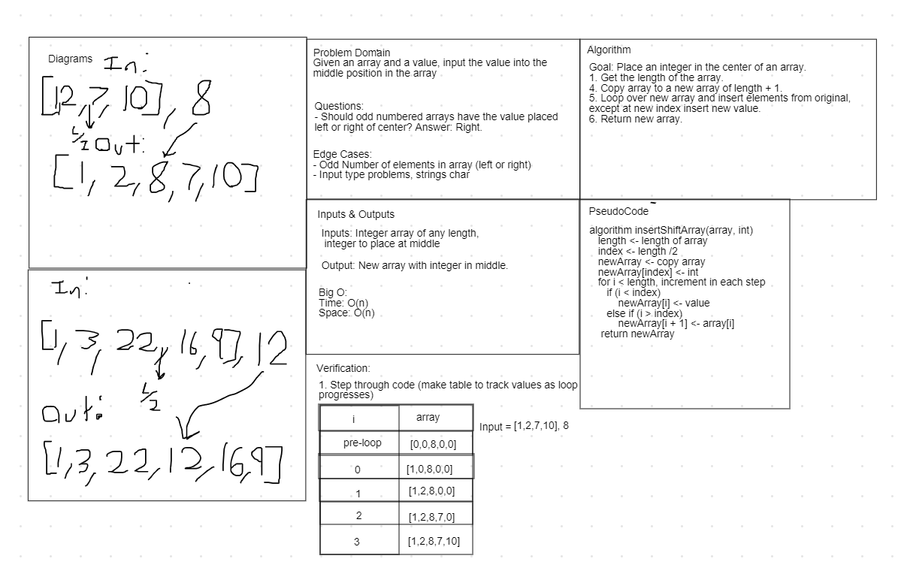

# Class 02 Code Challenge

## Array Shift
*Author: Nicco Ryan*

---

### Problem Domain
Given an array and an integer, return an array with the integer placed at the center point of the array.

---

### Inputs and Expected Outputs

| Input | Expected Output |
| :----------- | :----------- |
| [2,4,6,8], 5 | [2,4,5,6,8] |
| [4,8,15,23,42], 16 | [4,8,15,16,23,42] |

---

### Big O

| Time | Space |
| :----------- | :----------- |
| O(n) | O(n) |

---

### Whiteboard Visual

*Made w/ Paul Rest*

---

### Change Log
1.1: *Problem completed* - 7/7/2020 

---
